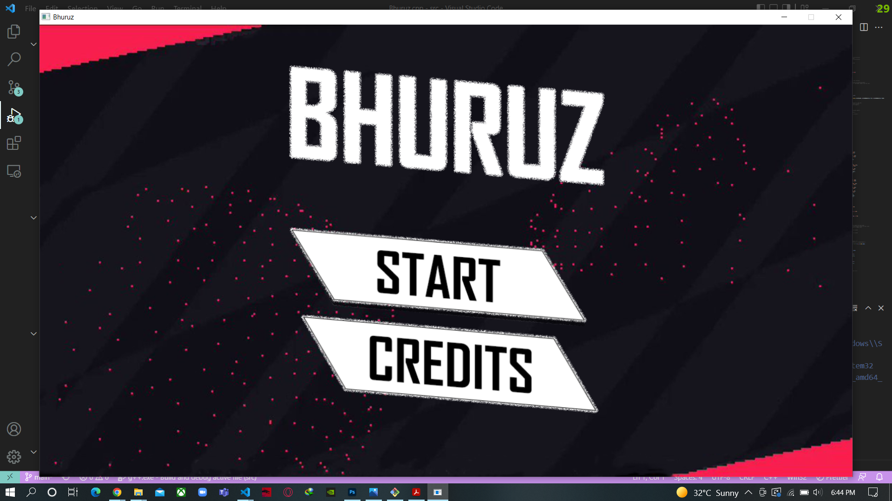
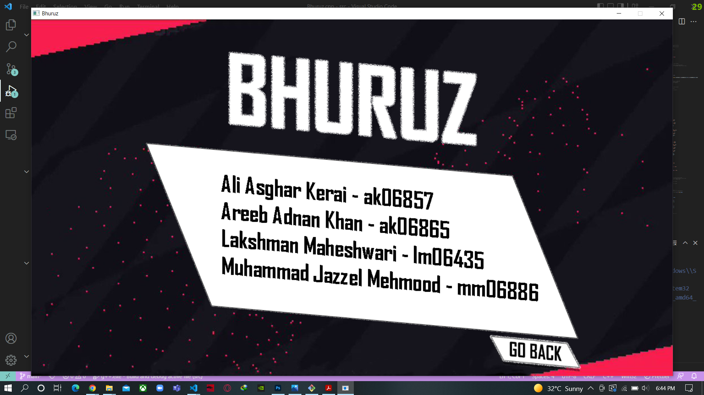
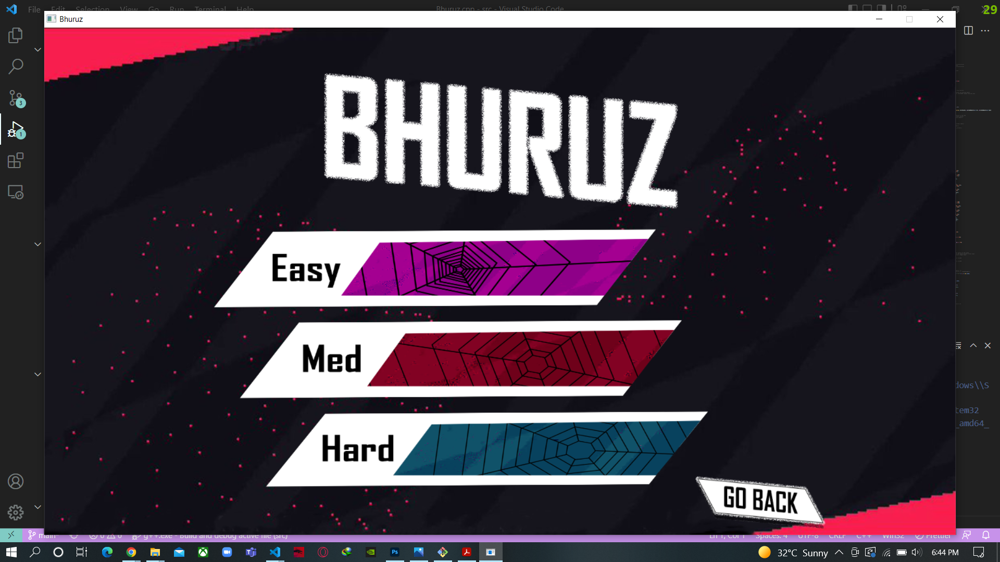

# Bhuruz

## OOP Project

### Team

- Ali Asghar Kerai
- Areeb Adnan Khan
- Muhammad Jazzel Mehmood
- Lakshman Maheshwari

### Description

Bhuruz is a obstacle tackling survival game in which the player has to tackle obstacles while moving through a
cylindrical tunnel as a bike type object. The start-end mechanism of the game depends on the health of the player
which decrements and increments in a few discrete levels and a health bar corresponding to the status of the player’s
health is displayed on the screen. The health decreases when the player hits the obstacles which they are supposed
to dodge. If the player hits the obstacle of the ”bomb” class, the game ends immediately irrespective of the available
health of the player. The game ends when the player runs out of health. The objects that the player might encounter
can be of varying sizes as well, and their size corresponds to the damage they will incur in the player’s health if the
collision occurs.

To make the game interesting and to give the player a chance to prolong their game play, health increment
object will also appear randomly in the path and if the player collides with those object, there will be an increment
in the player’s health. The score will be displayed on the screen alongside the health bar to indicate the progress of
the player. Assisting the player to navigate through the game, there will be 4 screens which include the Game Start
screen, the live game screen, the Game End screen and the credits screen.

Also, there are 3 levels of the game namely Easy, Medium and Hard. The player can choose to play either
of the levels before the game begins. The difficulty levels will be based on difference in the speed with which the
player will encounter obstacles while playing the game.

The player interacts with the game using the arrow/WASD keys and the mouse, in order to minimize the number
of keys being used for a better user experience.

To implement this game as the course project all the techniques of OOP will be applied namely classes and
objects, abstraction, encapsulation, inheritance and polymorphism. To improve the memory efficiency all/most of
the objects will be created dynamically. SDL 2.0 graphic library will be used to render the graphics for this game,
which is necessary to make the game interactive.

### Pre-requisites

- C++ (^20) - [Official Documentation](https://www.cplusplus.com/doc/tutorial/)
- SDL 2.0 - [Official Documentation](https://www.libsdl.org/)

### Setup

- Compiling all the files:

  `g++ *.cpp -IC:\mingw_dev_lib\include\SDL2 -LC:\mingw_dev_lib\lib -w -lmingw32 -lSDL2main -lSDL2 -lSDL2_image `

- Executing the project:

  `./a.exe`

### Screenshots

#### Home Screen

#### Credits Screen

#### Level Screen

